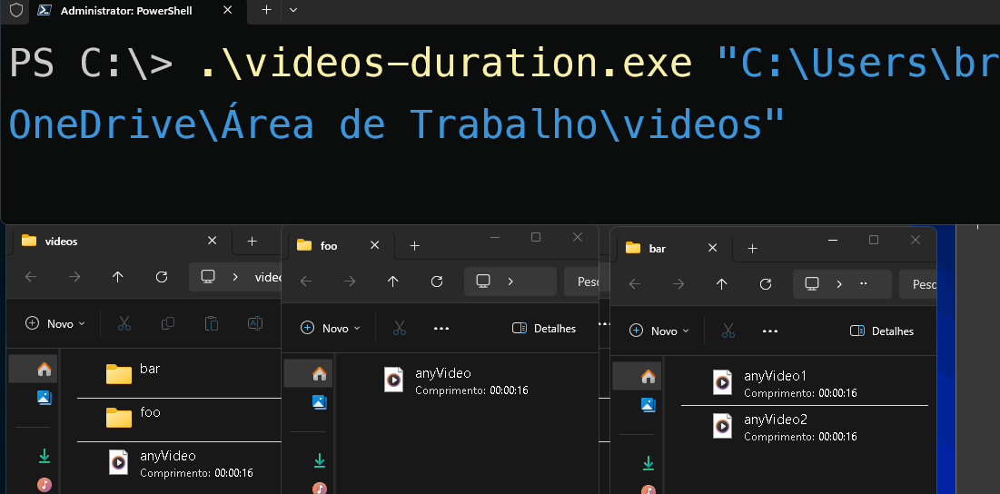

# 📽️ ⏲️

## Ferramenta em GOlang que soma a duração de todos os vídeos .mp4 em um diretório e seus subdiretórios.

### Para utilizar a ferramenta é necessário ter o FFMPEG instalado.

Instalação do FFMPEG (Windows)
```
winget install Gyan.FFmpeg
```
ou
```
choco install ffmpeg
```
ou *Dê seus pulos e pesquise no Google kkkkk*

Instalação do FFMPEG (Linux)
```
sudo apt install ffmpeg -y
```

## Rodando

```
go run main.go "caminho/dos/videos/"
```

Você pode criar o executável também.
```
go build main.go -o NOMEQUEQUISER
```

# Exemplo
