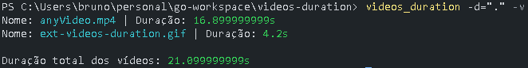
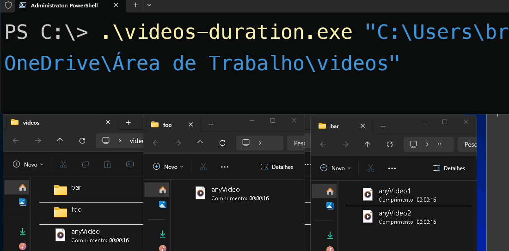

# 📽️ ⏲️

## Ferramenta em GOlang que soma a duração de todos os vídeos .mp4 em um diretório e seus subdiretórios.

### Para utilizar a ferramenta é necessário ter o FFMPEG instalado.

Instalação do FFMPEG (Windows)
```
winget install Gyan.FFmpeg
```
ou
```
choco install ffmpeg
```
ou *Dê seus pulos e pesquise no Google kkkkk*

Instalação do FFMPEG (Linux)
```
sudo apt install ffmpeg -y
```

## Rodando

## [Download dos Executáveis](https://github.com/Brunoquindeler/videos-duration/releases/tag/v1.0.0)

#### Ou você pode rodar ou compilar diretamente.

```
go run main.go -d="caminho/dos/videos/"
```

Você pode criar o executável também.
```
go build main.go -o NOMEQUEQUISER
```

## Modos de uso
```
Flags:
	-v | Modo verboso.
	-d | Diretório a ser escaniado.
	-h | Modo de ajuda.

Exemplos de uso:
	videos_duration -d="/caminho/do/diretorio" << Escaneia o diretório passado.

	videos_duration -d="."  << Escaneia o diretório atual.

	videos_duration -v -d="."  << Escaneia em modo verboso.
```

# Exemplo



